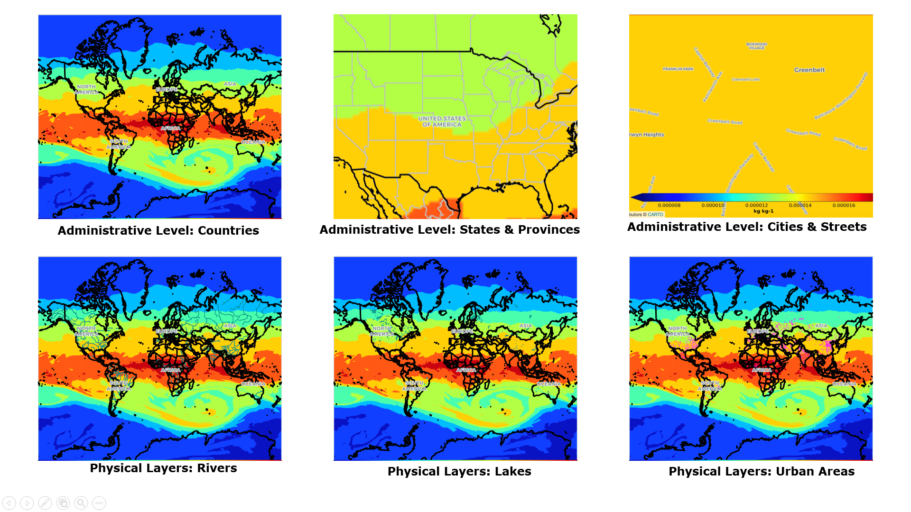

# Portfolio
---
## Data Science and Machine Learning
---
### [Latitudinal Shifts of Plant Functional Types within the Great Plains](/posts/Lat_Shift.md)

### [Forecasting PM2.5 & AQI Values across U.S. Embassy Sites and EPA Regions](/sample_page)

### [Cattell's 16 Personality Factors: Predicting Demographic Characteristics from Personality Types](/sample_page)

## Web Applications
---
### [Tracking Erroneous Measurements for Earth's Planetary Operations](/posts/TEMPO.md)

### [PennBook] (/posts/PennBook.md)

## GIS
---
### [Selected GIS Works](/posts/GIS_works.md)

